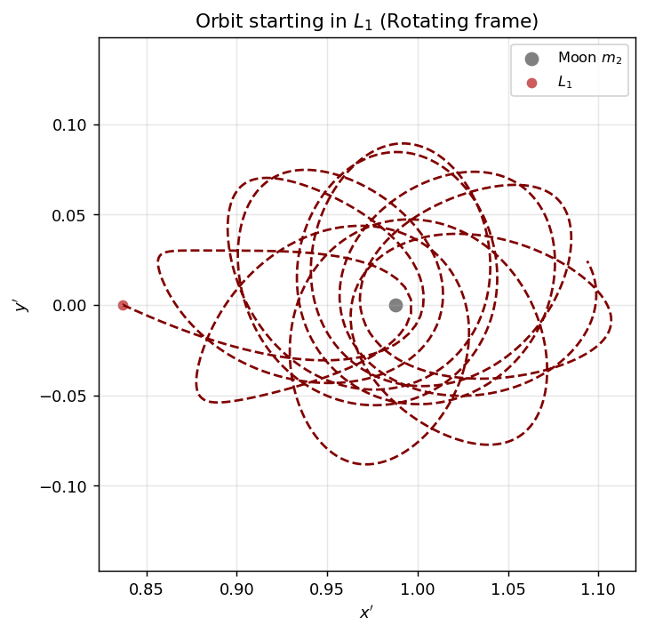
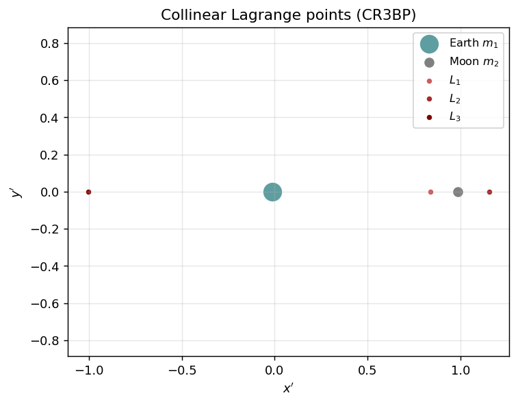
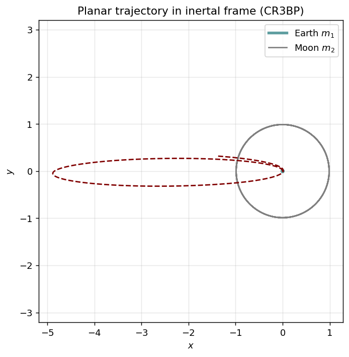
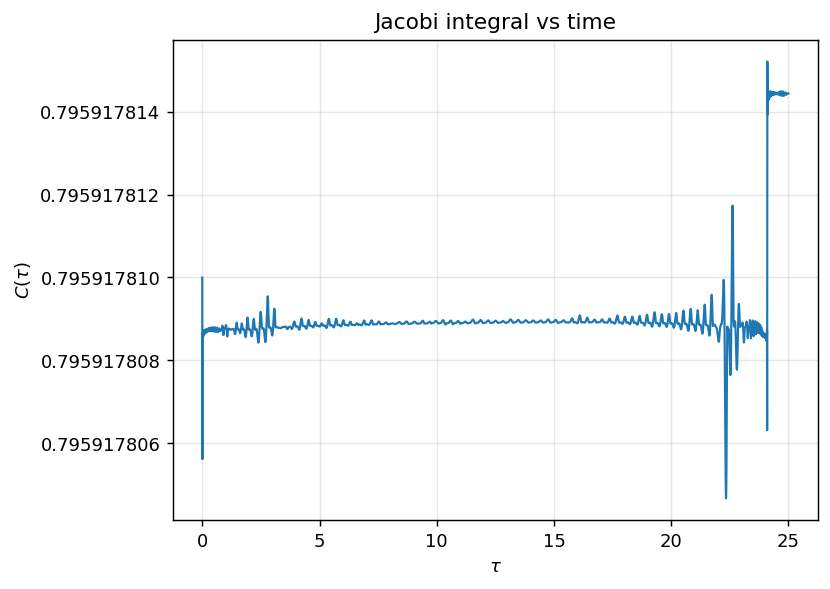

# Circular Restricted Three-Body Problem

Numerical study of the Circular Restricted Three-Body Problem (CR3BP), written for
TFY4345 *Classical Mechanics* at NTNU, autumn 2025. An individual project.

The CR3BP models the motion of a massless third body (a satellite) under the gravity of
two much larger bodies orbiting each other in a circle — here, Earth and the Moon. It's
the standard model behind real translunar trajectory design, including the Apollo
missions and modern lunar Gateway orbits.

## Results

### Instability of the L1 Lagrange point

A satellite released from rest exactly at the L1 point — the balance point between Earth
and the Moon — does not stay there. Tiny numerical fluctuations are enough to grow into a
large, looping departure from the equilibrium, shown here in the rotating frame over one
non-dimensional time unit. This confirms directly what the linear stability analysis
predicts: the collinear Lagrange points are saddle points of the effective potential, not
minima, so they are unstable equilibria. It's the reason real spacecraft that operate near
L1 (like SOHO or the James Webb Space Telescope near the Sun–Earth L2) need active
station-keeping rather than just parking there.

### The collinear Lagrange points

The equation for the collinear Lagrange points is a quintic with no closed-form solution
(a consequence of the Abel–Ruffini theorem), so the three points are found with Newton's
method applied separately in each of the three regions the potential is piecewise-defined
over:

| Point | Position (x′) | Newton iterations |
|---|---|---|
| L1 | 0.8369180073 | 7 |
| L2 | 1.1556799131 | 12 |
| L3 | −1.0050624018 | 16 |

### A translunar trajectory

Starting from a low-Earth-orbit-like altitude (6600 km) with an injection velocity taken
from the Apollo 11 mission report, the satellite follows a translunar-style transfer,
shown here after transforming the rotating-frame solution back into the inertial frame.

### Verifying the integrator with the Jacobi integral

The Jacobi integral is a conserved quantity of the CR3BP, so it provides a direct check on
the numerical integration independent of the equations of motion themselves. It stays
constant to roughly 1 part in 10⁸ over the full simulation, which confirms the solver is
behaving correctly rather than silently drifting.

## Method

The equations of motion are non-dimensionalised (introducing `x′ = x/a`, `τ = ωt`,
reducing to a system with two free parameters instead of six), converted to a first-order
system in six state variables, and integrated with SciPy's `solve_ivp` using the 8th-order
explicit Runge–Kutta method `DOP853` and tight tolerances (`rtol=1e-10`, `atol=1e-12`).
The Lagrange points come from a from-scratch Newton's method implementation using the
analytical first and second derivatives of the effective potential, rather than a generic
root finder.

## Files

- `CR3BP_solver.py` — the equations of motion and the rotating-to-inertial frame transform
- `jacobi_integral_CR3BP.py` — the conserved Jacobi integral, used to verify the solver
- `Lagrange_123_CR3BP.py` — Newton's method for the collinear Lagrange points
- `L1_init_orbit_CR3BP.py` — the orbit released from rest at L1
- `report.pdf` — the written report with the full non-dimensionalisation derivation

## Reading

- NASA, *Apollo 11 Mission Report* (1969) — source of the translunar injection velocity
- Abel–Ruffini theorem — why the Lagrange point equation needs a numerical, not closed-form, solution
