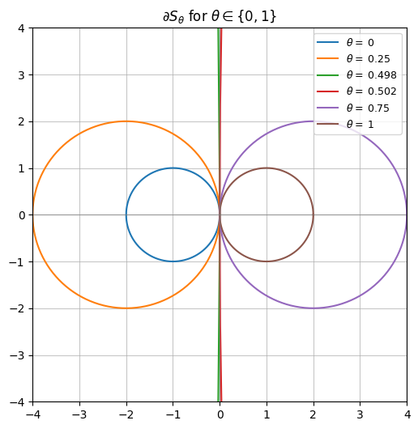

# Cahn–Hilliard phase separation

A Fourier spectral solver for the Cahn–Hilliard equation, which models how a mixture of
two substances spontaneously separates into regions of each — the process behind
spinodal decomposition and Ostwald ripening.

The equation is fourth order in space and nonlinear, which makes it stiff: an explicit
time integrator needs a step size scaling like the fourth power of the grid resolution.
Most of this project is about choosing a time integrator that survives that.

## Results

### Stability regions of the θ-method

The stability boundary of the θ-method, derived analytically as
|z| = 2 cos φ / (2θ − 1) and plotted here for several θ. At θ = 0 it is the unit circle
centred at −1 (explicit Euler); as θ → ½ the radius diverges and the method becomes
A-stable; beyond ½ the region inverts and the unstable set becomes the enclosed disc.
These curves match the numerically computed contours of |r_θ(z)| = 1 exactly.

### Phase separation

*[Re-run the notebook and drop the spinodal decomposition frames in here — they are the
single most compelling image in the project.]*

## Method

Under the Fourier transform the biharmonic operator becomes multiplication by |k|⁴, so a
fourth-order PDE collapses to elementwise arithmetic in frequency space. The solver is
built up in stages:

1. **Steady biharmonic solver** — Δ²u + cu = f, solved spectrally.
2. **Verification by manufactured solutions.** An exact solution is chosen, SymPy
   differentiates it symbolically to produce the matching source term, and `lambdify`
   turns both into NumPy functions. The experimental order of convergence is then
   measured in the max norm across a range of grid sizes.
3. **Transient solver** with the θ-method, implemented as a generator yielding the
   solution at each step.
4. **The full nonlinear problem** with convex–concave splitting (parameter α), treating
   the stiff linear part implicitly and the cubic term explicitly, and a higher-order
   IMEX scheme with four coefficient sets compared against each other.

Two findings worth pulling out of the report:

- **Aliasing is visible in the convergence data.** For the manufactured solution
  sin(8(x−1))cos(4y) the error drops off a cliff between Nx = 15 and Nx = 16 — exactly
  the Nyquist rate N ≥ 2·8 for the highest frequency present. Below it, high-frequency
  components fold onto lower ones and corrupt the solution.
- **The θ = 0 convergence study initially looked broken**, showing no error decay at all.
  Deriving the CFL condition for the explicit case gives τ ≤ 2/(κ|k|⁴ₘₐₓ), which for this
  problem means N_CFL ≈ 20 000 steps. The study had been run with 10 to 640. The method
  was fine; the time steps were nowhere near small enough.

The error for the smooth manufactured solution decays exponentially rather than
algebraically, as expected for a spectral method, confirmed with a curve fit.

## Files

- `cahn_hilliard.ipynb` — the full project
- `report.pdf` — written report with the analytical derivations

## Reading

- Cahn & Hilliard, *Free Energy of a Nonuniform System*, J. Chem. Phys. 28, 258 (1958)
