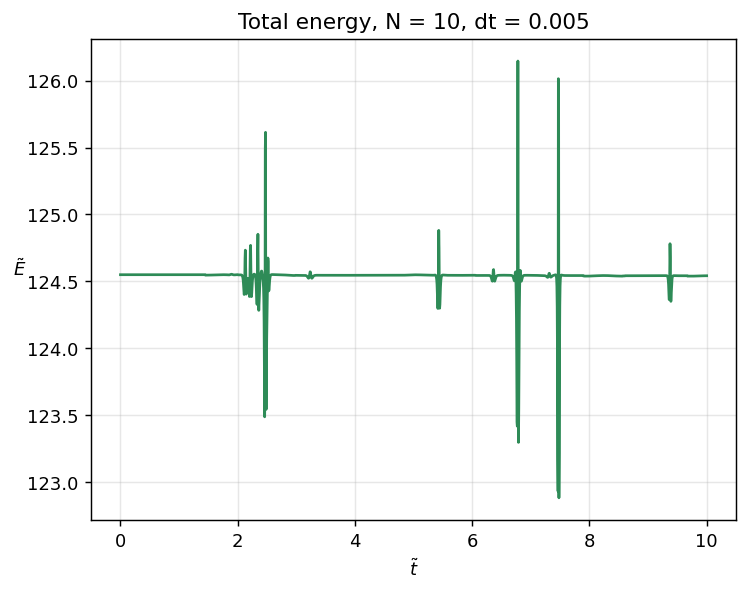
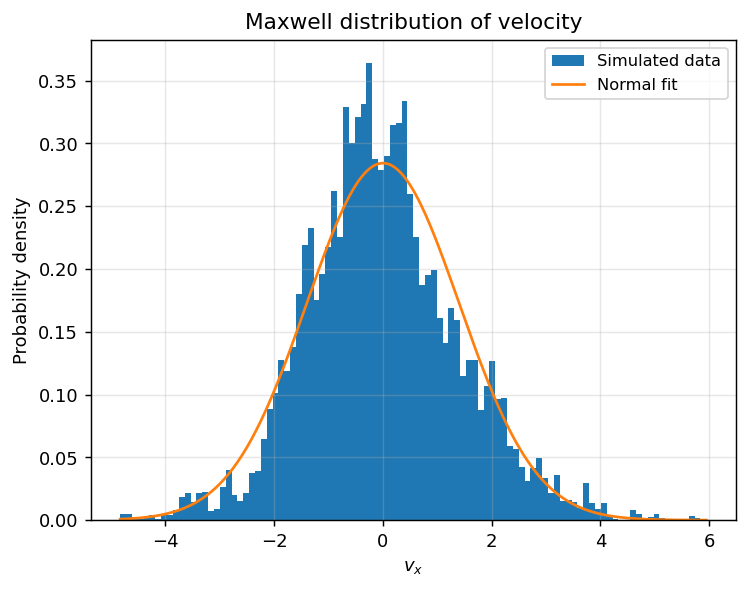
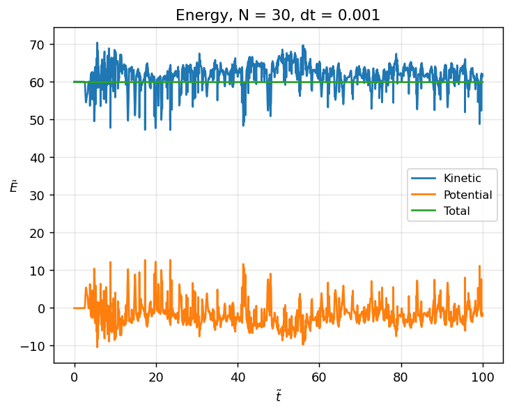

# 2D Lennard-Jones gas simulation

A molecular dynamics simulation of a 2D gas of particles interacting via a Lennard-Jones
potential, confined in a circular container with a soft wall. Written for TFY4230
*Statistical Physics* at NTNU, spring 2026. An individual project.

The goal is to recover macroscopic thermodynamic behaviour, the Maxwell speed
distribution, and the ideal gas law directly from simulating individual particle
trajectories, with no statistical mechanics assumed in advance.

## Results

### Energy conservation of the integrator

The total energy stays constant to good approximation, with brief spikes whenever two
particles pass close to each other. This is expected: the repulsive part of the
Lennard-Jones potential scales as 1/r¹², so it's very stiff at short range, and a
fixed-step integrator can't resolve a close encounter perfectly. The energy recovers as
soon as the particles separate again, and the spikes shrink as the timestep is refined. This is the signature of a discretisation artefact rather than a genuine bug.

### The Maxwell speed distribution emerges from the simulation

No statistical assumption is built into the simulation. The particles simply obey Newton's
second law. Sampling the x-velocity of all particles after the system has settled and
fitting a normal distribution recovers the Maxwell-Boltzmann velocity distribution
directly, with a clean Gaussian fit. Its variance gives the dimensionless temperature,
k_BT ≈ 1.9-2.0 in units of the Lennard-Jones well depth ε.

### Kinetic and potential energy over a long run

Over a long run (N = 30, dt = 0.001, T = 100), the kinetic energy fluctuates around a
roughly constant mean while the potential energy stays small and mostly positive relative
to it. The system behaves as a weakly-interacting, near-ideal gas rather than condensing
into a bound cluster.

### The ideal gas law, and where it breaks down

Not reproduced here as a figure since it requires 20 independent full-length simulations,
one per initial velocity, which takes on the order of an hour to run in full. The method
and result are described below; see `report.pdf` for the original plot.

The time-averaged pressure was computed from the reaction force on the container wall,
divided by its circumference, and compared against N k_BT from the Maxwell distribution
fit at the same conditions. The two sides of PA = N k_BT agree well at higher initial
velocities. As the initial velocity is lowered, the relative error grows to roughly 40%,
which is consistent with the gas condensing into a bound droplet rather than behaving
ideally, and thus the assumption of weak interactions (small potential energy relative to kinetic,
as seen in the figure above) starts to fail at the low end.

## Method

The particles obey Newton's second law with a Lennard-Jones interparticle potential and a
harmonic wall potential active only outside the container radius. The equations are
non-dimensionalised using the natural time scale τ = √(ma²/ε), which removes the physical
constants m, a, ε and leaves only the dimensionless wall stiffness K̃ and container size R̃
as free parameters. The resulting system is integrated with the velocity Verlet algorithm,
which is symplectic and therefore well suited to long-run energy conservation in an
N-body simulation like this one.

The particle-particle force calculation is the O(N²) part of the simulation and is
written as an explicit double loop over particle pairs rather than vectorised. This is deliberate
for a from-scratch physics implementation, but it means runtime scales with N² per
timestep and this is the main cost driver for larger N or longer runs.

## Files

- `Solver_statfys.py` — the physics: equations of motion, velocity Verlet integrator,
  energy, the Maxwell distribution fit, and pressure calculation
- `Statfys_prosjekt.py` — the full analysis script that produces every figure in the report
- `report.pdf` — the written report with the full non-dimensionalisation derivation
