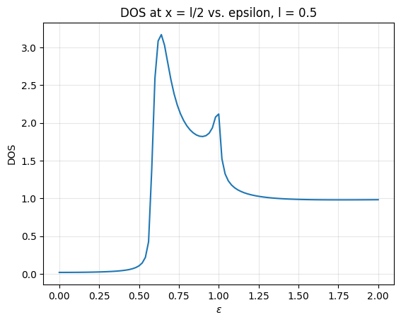
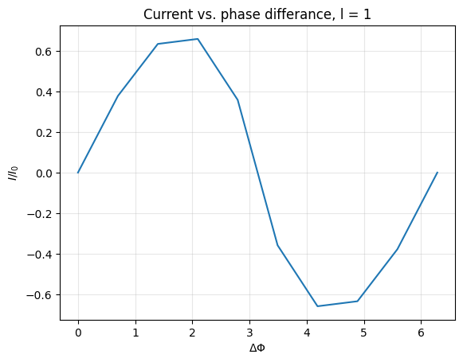

# Josephson junctions via the Usadel equation

Numerical study of the superconducting proximity effect in a
superconductor–normal metal–superconductor (S–N–S) junction, by solving the Usadel
equation in the Riccati parametrisation.

The physical output is the **current–phase relation** of the junction: the supercurrent
that flows through a piece of ordinary metal purely because of a phase difference between
the two superconductors on either side of it.

## Results

### Density of states in the normal metal

Density of states at the centre of the normal region, as a function of energy
(normalised to the superconducting gap). The metal is not superconducting, but
superconducting correlations leak in from both interfaces and open an induced
**mini-gap** near the Fermi level, with a coherence peak at its edge. The mini-gap
narrows as the junction gets longer, since the proximity effect decays with distance
from the interfaces. The smaller feature near ε ≈ 1 comes from Andreev reflection:
the normal region acts as a resonant cavity for quasiparticles with energies near the
gap edge.

### Current–phase relation

The current is 2π-periodic and roughly sinusoidal in the phase difference across the
junction. This is the DC Josephson effect. With zero phase difference the current integrand
is numerically zero everywhere, as it must be.

## Method

The Usadel equation is a boundary value problem in four coupled complex 2×2 Riccati
matrices. SciPy's `solve_bvp` only handles real-valued systems, so the solver packs the
four matrices and their derivatives into a **32-component real vector**, integrates, and
unpacks on the other side. `test_matrix_vector_conversion` and `test_vector_32_conversion`
assert that packing and unpacking are exact inverses.

Boundary conditions of Kupriyanov–Lukichev type are applied at both interfaces, with an
interface-to-bulk resistance ratio ζ and a phase angle for each superconductor.
The density of states and the current integrand are then computed from the Green's
function, and the current follows from Simpson integration over energy.

Two details that mattered for runtime:

- **Continuation.** The converged solution at one energy is used as the initial guess
  for the next, which keeps `solve_bvp` in its basin of convergence and cuts iteration
  counts sharply.
- **Parallelisation.** The sweep over phase differences is embarrassingly parallel and
  is distributed with `ProcessPoolExecutor`.

The first part of the project builds the ODE machinery from scratch before reaching for
SciPy: an adaptive third-order Runge–Kutta method with an embedded higher-order estimate
for local error control and a step-size controller, wrapped in a secant-method shooting
scheme to turn a two-point boundary value problem into root finding. This implementation
is then **benchmarked against `solve_bvp`**, which is roughly 3.8× faster; the remaining
discrepancy between the two solutions is traced to the secant tolerance on the shooting
parameter rather than to the order difference between the methods.

## Files

- `usadel_josephson.ipynb`, the full project
- `report.pdf`, written report with the analytical derivations

## Reading

- Usadel, *Generalized Diffusion Equation for Superconducting Alloys*, PRL 25, 507 (1970)
- Schopohl & Maki, Riccati parametrisation of the quasiclassical equations
